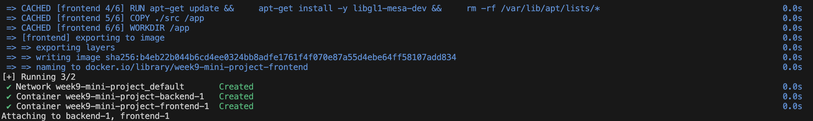
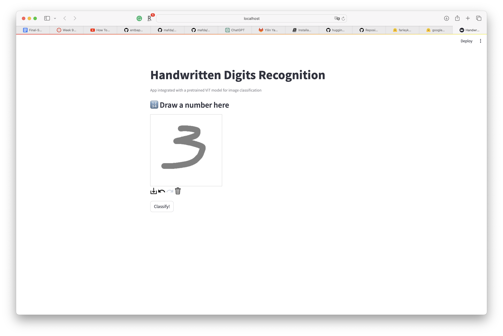
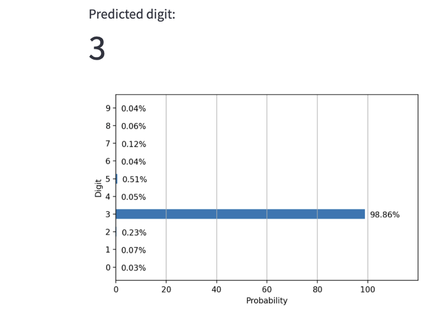

# Streamlit App with a Hugging Face Model

## Getting started

- Create a website using Streamlit
- Connect to an open source LLM (Hugging Face)
- Deploy model via Streamlit or other service (accessible via browser)

## Setup
### Use pre-trained model from [Hugging Face](https://huggingface.co/google/vit-base-patch16-224)
```python
# Use a pipeline as a high-level helper
from transformers import pipeline

pipe = pipeline("image-classification", model="google/vit-base-patch16-224")
```

```python
# Load model directly
from transformers import AutoImageProcessor, AutoModelForImageClassification

processor = AutoImageProcessor.from_pretrained("google/vit-base-patch16-224")
model = AutoModelForImageClassification.from_pretrained("google/vit-base-patch16-224")
```
## Run
1. [Install
   Streamlit](https://docs.streamlit.io/library/get-started/installation). I
   recommend you use **Conda and set up your environment**, but you can use:

    ```shell
    pip install streamlit
    ```

2. [Create](https://docs.streamlit.io/library/get-started/create-an-app) setup a docker-compose file to run the app:

    ```shell
    docker-compose up
    ```
    
3. [Run](https://docs.streamlit.io/library/get-started/main-concepts) it:

    ```shell
    streamlit run app.py
    ```

    As soon as you run the script, a local Streamlit server will spin up, and
    your app will open in a new tab in your default web browser.

    Or you can navigate to `http://localhost:8501`.

## Result


## Resources
https://huggingface.co/google/vit-base-patch16-224
https://huggingface.github.io/candle/guide/installation.html
## Streamlit link:
https://huggingface-week9-mini-project-3apnycqbfeh7q7cypm7iuc.streamlit.app